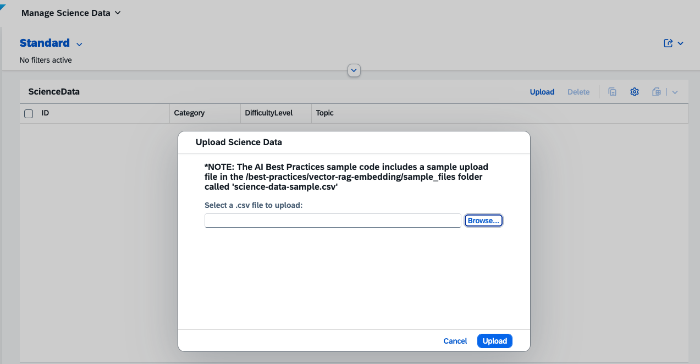
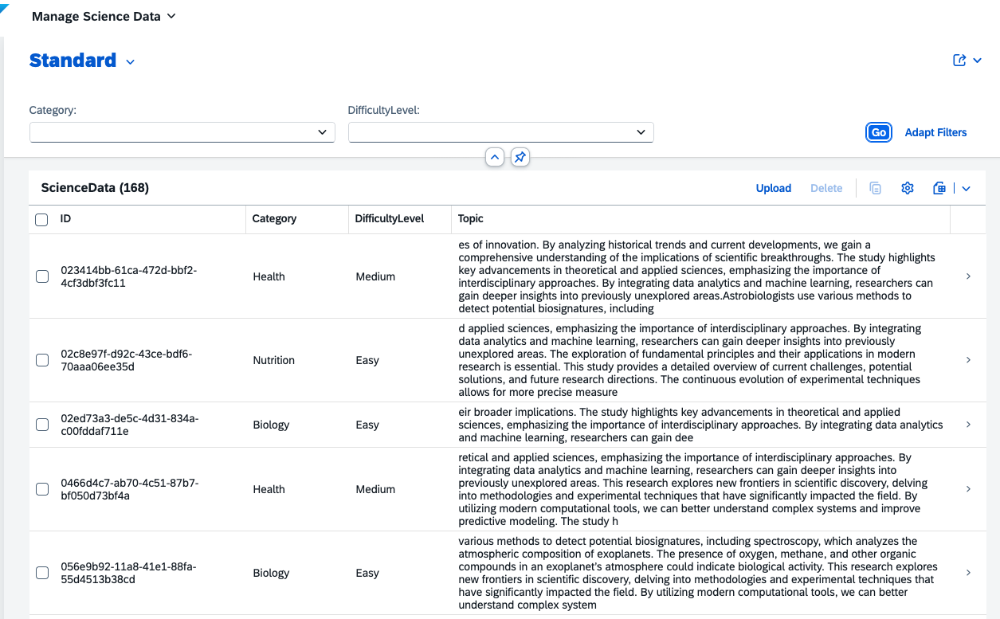

# SAP BTP AI Best Practice Demo - Vector Embedding (RAG) - CAP (fullstack)

This project demonstrates best practices for accessing Embeddings models using the SAP GenAI Hub and storing them in SAP HANA Vector Store. It provides examples of different ways to create and store embeddings in the vector store.

## Prerequisites

- SAP Business Technology Platform account
- Access to SAP AI Core service
- Node.js LTS version
- Cloud Foundry CLI

## Configuration

The application requires proper configuration to connect to the SAP AI Core service. This is handled through CDS bindings in both local and remote deployments.

## Project Structure

```
fullstack-sample/
├── app/                      # UI5 frontend applications
│   ├── manage-science-data/  # UI5 application 
│   │    ├── webapp/          # UI5 application source code
│   │    ├── package.json     # Frontend dependencies
│   │    ├── ui5.yaml         # UI5 tooling configuration
│   │    └── README.md        # Frontend documentation
│   ├── appconfig/            # Launchpad configuration for local testing 
│   ├── router/               # Approuter configuration
│   └── index.html            # Launchpad home page for local testing
├── db
│   └── schema.cds           # Entity definitions used for HANA database schema
├── srv/                     # Service layer containing CAP services
│   ├── types.ts             # Type definitions for use in service
│   ├── services
│   │    └── ai-sdk.ts       # Logic for interacting with the AI SDK
│   ├── utils
│   │    └── csv-file.ts     # CSV File parsing utility
│   ├── rag-service.cds      # CAP Service Definition
│   └── rag-service.ts       # CAP Service Implementation
├── package.json             # Project dependencies and scripts
├── tsconfig.json            # TypeScript configuration
├── mta.yml                  # CF deployment configuration
└── README.md                # Project documentation
```

## Local Deployment

1. Install dependencies using `npm install`.

2. Login using `cf login -a API_ENDPOINT -o ORG -s SPACE`.

3. Bind the application to your AI Core instance:

   ```bash
   cds bind -2 AI_CORE_INSTANCE_NAME:AI_CORE_INSTANCE_SERVICE_KEY_NAME
   ```

4. Build the HANA / HDI Container
   ```bash
   npm run build:db
   ```

5. Run the application with the binding:

   ```bash
   npm run watch
   ```

## Remote Deployment

1. Install dependencies using `npm install`.
2. In the `mta.yml`, under the `resources` section on the `best-practices-aicore`, modify the `service-name` from `best-practices-aicore` to the name of your AI Core Service instance.
3. Transpile the CAP application using `npm run build`.
4. Login using `cf login -a API_ENDPOINT -o ORG -s SPACE`.
5. Deploy the application using `npm run deploy`.

## Usage

The application will serve the following APIs:
 - POST `/uploadScienceData` upload and created embeddings for the science data from a CSV file.
 - GET `/scienceData` view the uploaded science data

For local deployment, set `SAMPLE_CAP_HOST` as `http://localhost:4004`. For remote deployment, set `SAMPLE_CAP_HOST` as the value returned from the deployment step.

> [!WARNING]  
> All CDS services are marked with `@requires: 'any'` and are publicly accessible in order to simplify the testing and deployment process.
> Apply proper authentication mechanisms to avoid unauthorized access.

### Upload csv file
```bash
curl --request PUT --url http://SAMPLE_CAP_HOST/odata/v4/rag/ScienceDataUpload/content \
  --header 'Content-Type: text/csv' \
  --data-binary '@../../sample_files/science-data-sample.csv'
```

#### Sample UI - Upload CSV



### View Science Data
```bash
curl --request GET --url http://SAMPLE_CAP_HOST/odata/v4/rag/ScienceData
```
#### Sample UI - View Science Data


## Contributing

Contributions are welcome! Please open an issue or submit a pull request for any improvements or bug fixes.